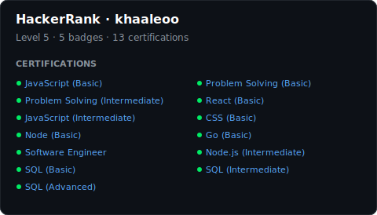

<h1 align="center">Hi 👋, I'm Leo</h1>

  Software Engineer in Ho Chi Minh City, Vietnam. 
  I dig into distributed systems &amp; system design, and write about it on <a href="https://lexuankha.com"><b>my blog</b></a>.

  
  
  
  

## 🧰 Tech Stack

  

## 📊 GitHub Stats

  
  

## 🏆 Coding Profiles

  <!-- CODINGAME:START -->
  
  <!-- CODINGAME:END -->

  <!-- HACKERRANK:START -->
  
  <!-- HACKERRANK:END -->

---

  📫 Open to interesting backend / full-stack opportunities — <a href="mailto:khalx.se@gmail.com">khalx.se@gmail.com</a>

