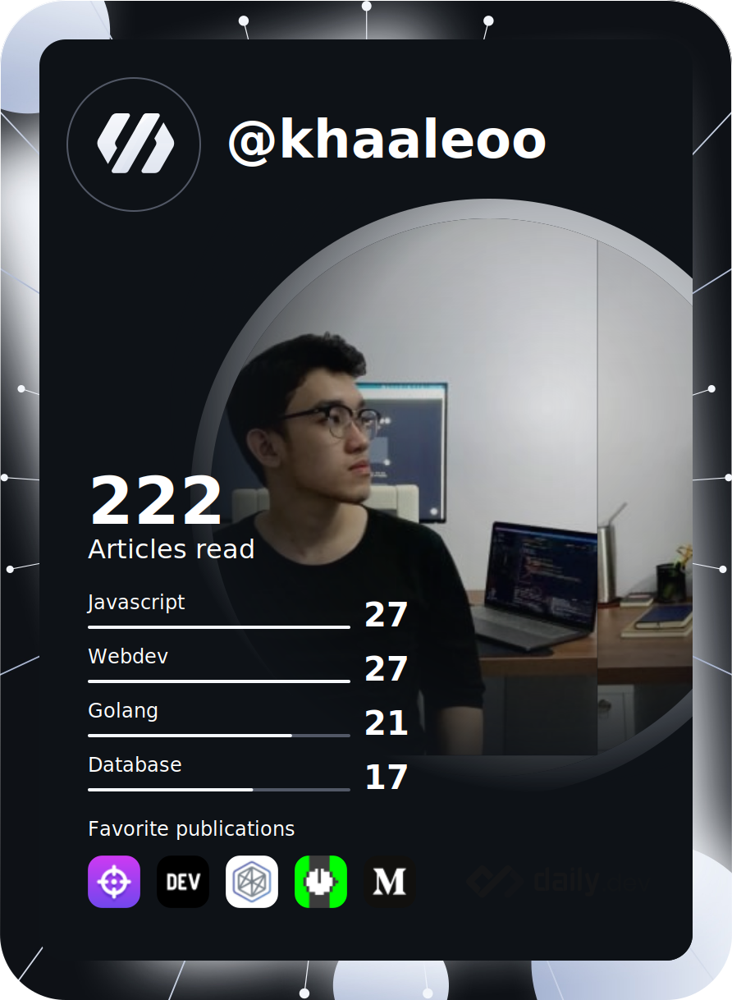

<h1 align="center">Hi 👋, I'm Leo</h1>
<h3 align="center">Software Engineer</h3>

 

## 🌐 Connect with me via
 

# 💻 Tech Stack:
                    	               

#  🪪 Dev card:

# 📊 GitHub Stats:
 
 

## 🏆 GitHub Trophies

### 🔝 Top Contributed Repo

<!-- Proudly created with GPRM ( https://gprm.itsvg.in ) -->
